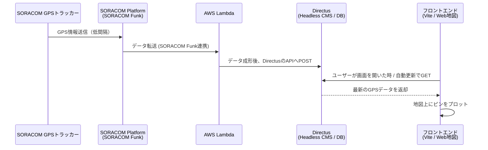

# リアルタイムGPSトラッキングアプリの裏側：SORACOM × AWS Lambda × Directusで作るIoT地図アプリ

## はじめに
本記事では、SORACOMのGPSトラッカーを用いたリアルタイム位置情報アプリ（アプリ名：Ohwatcha などを想定）の仕組みとアーキテクチャについて解説します。
デバイスから取得したGPS情報が、どのようにしてフロントエンドの地図上に描画されるのか、バックエンドの技術スタックを中心に紹介します。

## システム構成図 / 全体アーキテクチャ

このアプリケーションは、大きく分けて以下の4つのコンポーネントから構成されています。

1. **IoTエッジデバイス**: SORACOM GPSトラッカー
2. **ルーティング/処理**: SORACOM Funk ＋ AWS Lambda
3. **バックエンド (データ蓄積 & API)**: Directus (Headless CMS)
4. **フロントエンド**: Vite (JavaScript / Leaflet等を使用)

### 処理の流れ

---

## 各コンポーネントの役割と技術選定の理由

### 1. SORACOM GPSトラッカーの活用
GPSデータを送信するためのデバイスとして、SORACOM環境にネイティブに繋がるトラッカーを利用しています。
電源を入れるだけで自動的に通信網に繋がり、短時間の間隔（低間隔）で継続的に位置情報をクラウドに送信することができます。

### 2. SORACOM Funk + AWS Lambda によるサーバーレスなデータ中継
デバイスから送られてくるデータをそのままデータベースに保存するのではなく、**SORACOM Funk** を活用して **AWS Lambda** を呼び出しています。

- **理由**: SORACOM Funkを使うことで、トラッカー側は認証情報を持つ必要がなく、シンプルにデータを投げるだけに特化できます。
- **Lambdaの役割**: 送られてきたバイナリやJSONデータをパースし、DirectusのAPIスキーマに合わせてデータを成形し、HTTP(S)経由で登録(POST)します。

### 3. バックエンドに Headless CMS「Directus」を採用
データベースの構築とAPI化の手間を大幅に削減するため、バックエンドにはオープンソースのHeadless CMSである **Directus**（Postgresベース）を採用しています。

- **Directusのメリット**: データベースのテーブル（コレクション）を作成するだけで、自動的に即座にREST / GraphQL APIが生成されます。
- LambdaからのPOSTを受け付ける専用のロール・トークンを発行し、セキュアにGPSデータの蓄積を行っています。
- アプリの管理者はDirectusの管理機能（GUI）を使って、トラッカー端末のマスター管理や、蓄積されたGPSログの確認を簡単に行うことができます。

### 4. フロントエンド（Viteベース）
ユーザーが閲覧する画面は、**Vite**をビルドツールに使った軽量なWebフロントエンドとして構築しています。（地図の描画には Leaflet.js などを活用）

- Directusが提供するAPIエンドポイントに対してフロントエンドからfetchを行い、最新の座標データを取得します。
- 取得した位置情報を地図上にリアルタイム（または定期ポーリング）でプロットします。

---

## この構成のメリットまとめ

- **開発スピードの向上**: APIの開発や管理画面の構築をDirectusが担うため、ロジック部分は「Lambdaでのデータ変換」と「フロントエンドでの地図描画」に集中できました。
- **セキュアなIoT通信**: SORACOM Funkを活用することで、デバイス内にクラウドのアククセスキーやDBのパスワード等を持たせる必要がなくなり、安全にデータを転送できています。
- **スケーラビリティ**: SORACOM ＋ Lambdaにより、大量のデバイスや高い送信頻度でもサーバーの構成を気にすることなく捌くことができます。

## 今後の展望・まとめ
（※ ここに「今後はプッシュ通知も入れたい」「バッテリー消費の最適化を行いたい」といった今後のTODOや、実装で詰まったポイントなどを記載）
